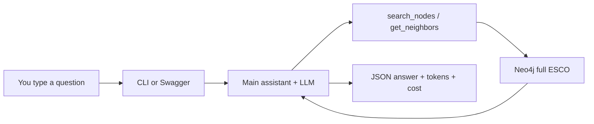

# Mentee handoff — TA-agents + ESCO (Aman)

Use this if you are picking up after me. Official `main` is **not** the
working demo. The working code is the **tip** below.

| | Use this |
| --- | --- |
| Agents demo | [`AmanSarraf/TA-agents`](https://github.com/AmanSarraf/TA-agents) branch **`feature/mvp-polish`** |
| Agents review (first PR) | [LFX-Talent-Angels/TA-agents#4](https://github.com/LFX-Talent-Angels/TA-agents/pull/4) |
| Graph tools | [TA-taxonomies PR #5](https://github.com/LFX-Talent-Angels/TA-taxonomies/pull/5) (`feature/esco-tools`) |

---

## 1. The story (plain language)

Talent Angels has **two repos**:

1. **TA-taxonomies** — the ESCO map in Neo4j (load the data, answer graph questions).
2. **TA-agents** — the assistant. It reads a question, calls the map, writes an answer.

The map is split into three official PRs:

| PR | What it is | Status |
| --- | --- | --- |
| **#3** | Shared types (`search_nodes`, `get_neighbors`, …) | On official `main` |
| **#4** | Loader (xlsx → Neo4j) | On official `main` |
| **#5** | Real tools (`EscoSuite`) the agent calls | **Still open** — this is the taxonomies tip |

Official taxonomies `main` can **load** ESCO. It cannot **query** it. The agent
needs **#5** on your machine.

The agent was built as a **stack** of small PRs (easier to review than one
giant PR). Official agents `main` is still the old Locate-only MVP.

```text
official agents main     = old Locate only
        ↓
A tests → B registry → C plans → D Locate → E Connect
        → F LiteLLM → G plan/answer → H tool loop → I polish   ← TIP
```

**PR A** is open for review: [#4](https://github.com/LFX-Talent-Angels/TA-agents/pull/4).  
B–I are **drafts** on top. Do not merge B–I yourself.

**What the demo can do today**

- Find an occupation (Locate).
- List its skills (Connect).
- Use a real LLM to decide which graph call to make.
- Print tokens and cost.
- Say no honestly to “path from A to B” (Pathfind is **not** built yet).

**What it cannot do**

- Remember the last question (no session memory).
- Draw a learning path between two jobs.
- Search “similar to nurse” with embeddings (search is lexical CONTAINS).



---

## 2. Folder layout

```text
TA-workspace/
  TA-taxonomies/     graph + loader + EscoSuite
  TA-agents/         this repo — clone the fork tip
```

If you only have this repo, put taxonomies next to it (`../TA-taxonomies`).

---

## 3. Setup the graph (once)

### 3.1 Neo4j

```bash
cd TA-taxonomies
docker compose up -d
docker compose ps          # wait until ta-neo4j is healthy
```

Browser: http://localhost:7474  
User / password: `neo4j` / `taxonomies-dev`

**Never** `docker compose down -v` — that deletes the graph.

### 3.2 Tools branch + install

```bash
cd TA-taxonomies
git fetch origin
git switch feature/esco-tools          # same as PR #5
python3 -m venv .venv
source .venv/bin/activate
pip install -e ".[dev]"
pip install openpyxl
```

### 3.3 Full ESCO load (once)

You need the English DATABASE xlsx (not in git). Download from
[ESCO](https://esco.ec.europa.eu/en/use-esco/download) into
`data/esco/raw/DATABASE/` so that `occupations_en.xlsx` exists.

```bash
export ESCO_DATA_DIR=data/esco/raw/DATABASE
ls "$ESCO_DATA_DIR/occupations_en.xlsx"

NEO4J_URI=bolt://localhost:7687 NEO4J_USER=neo4j NEO4J_PASSWORD=taxonomies-dev \
  python -m ta_taxonomies.suites.esco.load --mode full
```

This **replaces** whatever is in Neo4j. Run it **once**.

**Do not** run `--mode fixture` or `pytest tests/suites/esco` against this
database. Those wipe the graph down to **61** nodes. Then nurse disappears.

### 3.4 Check you have the full map

```bash
NEO4J_URI=bolt://localhost:7687 NEO4J_USER=neo4j NEO4J_PASSWORD=taxonomies-dev \
python - <<'PY'
from ta_taxonomies.suites.esco.db import neo4j_driver
with neo4j_driver() as (driver, database):
    with driver.session(database=database) as s:
        print("nodes", s.run("MATCH (n) RETURN count(n) AS c").single()["c"])
        print("occupations", s.run("MATCH (n:Occupation) RETURN count(n) AS c").single()["c"])
        print("nurse", s.run(
            "MATCH (n:Occupation) WHERE toLower(n.pref_label) CONTAINS 'nurse' "
            "RETURN count(n) AS c"
        ).single()["c"])
PY
```

| | Fixture (wrong) | Full (good) |
| --- | ---: | ---: |
| Nodes | 61 | ~18,237 |
| Occupations | 6 | ~3,039 |
| Nurse occupations | 0 | many |

---

## 4. Setup the agent

```bash
git clone https://github.com/AmanSarraf/TA-agents.git
cd TA-agents
git switch feature/mvp-polish

python3 -m venv .venv
source .venv/bin/activate
pip install -e ".[dev]"
pip install -e ../TA-taxonomies     # must be the #5 / esco-tools checkout
cp .env.example .env
```

Edit `.env` (never commit it):

```dotenv
LLM_PROVIDER=litellm
LLM_MODEL=openrouter/poolside/laguna-s-2.1:free
OPENROUTER_API_KEY=sk-or-...
ANSWER_MODE=natural

NEO4J_URI=bolt://localhost:7687
NEO4J_USER=neo4j
NEO4J_PASSWORD=taxonomies-dev
```

The CLI loads `.env` itself. You do not need `source .env`.

---

## 5. Test it

Offline (no Neo4j, no key):

```bash
ruff check . && ruff format --check . && mypy src
pytest -q --ignore=tests/integration
```

Live questions:

```bash
python -m talent_angels.cli query "Where is software developer in ESCO?"
python -m talent_angels.cli query "What essential skills does a software developer need?"
python -m talent_angels.cli query "developer"
python -m talent_angels.cli query "what skills I need to become a nurse"
python -m talent_angels.cli query "What essential skills does a nurse responsible for general care need?"
python -m talent_angels.cli query "What is the skill path from data analyst to data scientist?"
```

| Question | You should see |
| --- | --- |
| Where is software developer | Locate, high confidence |
| Essential skills / software developer | Locate then Connect, skill names from the graph |
| `developer` | Ambiguous — ask which one, **no** skill list |
| Become a nurse | Ambiguous menu of **ESCO** titles (not US RN/NP invented) |
| Nurse responsible for general care | Many essential skills |
| Path analyst → scientist | Warning: Pathfind not in this MVP, **no** neighbor dump |

Swagger (same engine):

```bash
uvicorn talent_angels.api.app:app --reload
# http://127.0.0.1:8000/docs  →  POST /v1/query
```

---

## 6. Add your own work

Branch **from the tip**, not from official `main`.

```bash
cd TA-agents
git switch feature/mvp-polish
git pull origin feature/mvp-polish
git switch -c feature/your-thing
```

Keep the rules in `ARCHITECTURE.md` / `CLAUDE.md`:

- One main assistant. Locate / Connect / Pathfind are **skills + tools**, not extra chat agents.
- Graph walk stays in code (`search_nodes`, `get_neighbors`, later `enumerate_paths`).
- Typed results (`AgentResult`). Do not invent occupations or skills.
- New behavior ships with a test. Commits need `git commit -s` (DCO).
- Do not commit `.env`.

Good next features (if you want a starting point):

- Session memory: after “which nurse?”, the next turn can Connect.
- Pathfind: `enumerate_paths` after taxonomies #5 is the pin you trust.
- Better “no match” retries (search `nurse`, not the whole sentence).

Open your PR from **your fork** into `LFX-Talent-Angels/TA-agents`, stacked on
`feature/mvp-polish` until that tip is on official `main`.

---

## 7. Agent PR stack (review only)

All heads live on the fork [`AmanSarraf/TA-agents`](https://github.com/AmanSarraf/TA-agents).

| Order | Branch | Org PR | Status |
| --- | --- | --- | --- |
| A | `feature/test-integration-integrity` | [#4](https://github.com/LFX-Talent-Angels/TA-agents/pull/4) | Ready |
| B | `feature/suite-registry-esco` | draft | Wait for A |
| C | `feature/typed-intent-planning` | draft | Wait for B |
| D | `feature/locate-hardening` | draft | Wait for C |
| E | `feature/connect-skill` | draft | Wait for D |
| F | `feature/litellm-provider` | draft | Wait for E |
| G | `feature/llm-intent-answer` | draft | Wait for F |
| H | `feature/llm-tool-loop` | draft | Wait for G |
| I | `feature/mvp-polish` | draft | Wait for H — **demo tip** |

Do **not** merge the top of the stack. That would land everything at once.

GitHub “Create stack” is a preview and **does not work across forks**. We
stacked by setting each PR’s base to the previous branch. Leave that as-is.

---

## 8. Do not

- Use official agents `main` as your starting point.
- Use official taxonomies `main` for live search (no `EscoSuite` until #5 merges).
- Run `--mode fixture` on the demo Neo4j.
- Treat Pathfind refuse as a bug.
- Expect the agent to remember the last turn.

---

## 9. If something is wrong

| Symptom | Fix |
| --- | --- |
| Node count `61` | Fixture graph. Run `--mode full` once. |
| `cannot import EscoSuite` | Taxonomies checkout is not PR #5 / `feature/esco-tools`. |
| `tokens.calls: 0` and a dry locate | `LLM_PROVIDER` is still `none`. Check `.env`. |
| Nurse `not_found` on full graph | Search text may be the whole sentence; try the ESCO title from an ambiguous menu. |
| `Provider List:` in the terminal | LiteLLM ad. Polish suppresses it; not a crash. |

Questions: ping Aman. Please keep full ESCO loaded so we do not reload it again.
